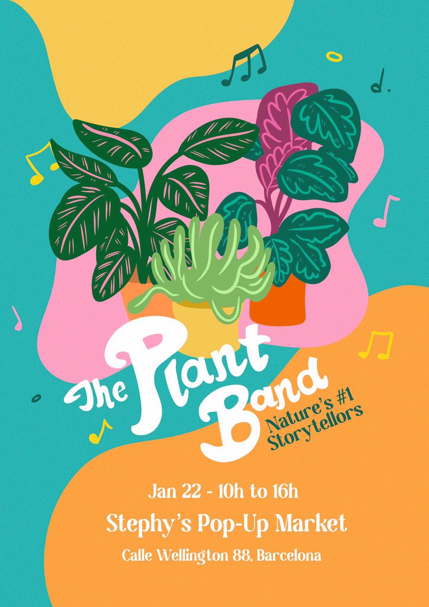

---
hide:
    - toc
---

# Design Intervention

## The Plant Band

The Plant Band is a group of plants that sonically expresses their story, feelings and rhythm in the form of song. With the use of arduino circuitry, we can translate their voices into sounds designed for humans to form connections with. 

The initial idea is to challenge children and their parents to deeply listen the plant sounds so they can interpret what they are saying. We hope that this activity brings humans closer to the realization that plants are living beings we can have relationships with despite their static appearence.

## How Does the Plant Band Work?

> The plants are hooked up to sensors that detect the invisible biological processes within the plants. These fluctuations are turned into MIDI data and sent to a synthesizer to make them into musical sounds. The resulting music is unique to each plant and changes throughout the day! We don't have much control over the notes generated from the plants and their songs vary depending on the amount of light and water they receive, soil, species, and possibly even more.

This hardware and code is based on an open source project by Sam Cusumano. You can find out more about his work and details on how to build this on Electricity for Progress.

## Engagement 

I am becoming a father soon so I constantly think about the future my child would be apart of. The true essence of nature should be experienced by the upcoming generations so they inately know how to care for it. Our intervention group cwas inspired by the question: "How do children understand nature?". Through the experience of becoming a father, my partner and I became connected to a network of parents, doulas and child services. I was able to connect with the owner of Stephy's, a cafe that also is a child daycare center. 

We were invited by Stephy to showcase the Plant Band to be the entertainment for a popup market she is holding January 22nd, 2023.

## See Also

[Biodata Sonification](https://electricityforprogress.com/biodata-sonification/)

[Stephy's Instagram](https://www.instagram.com/stephysbcn/)
