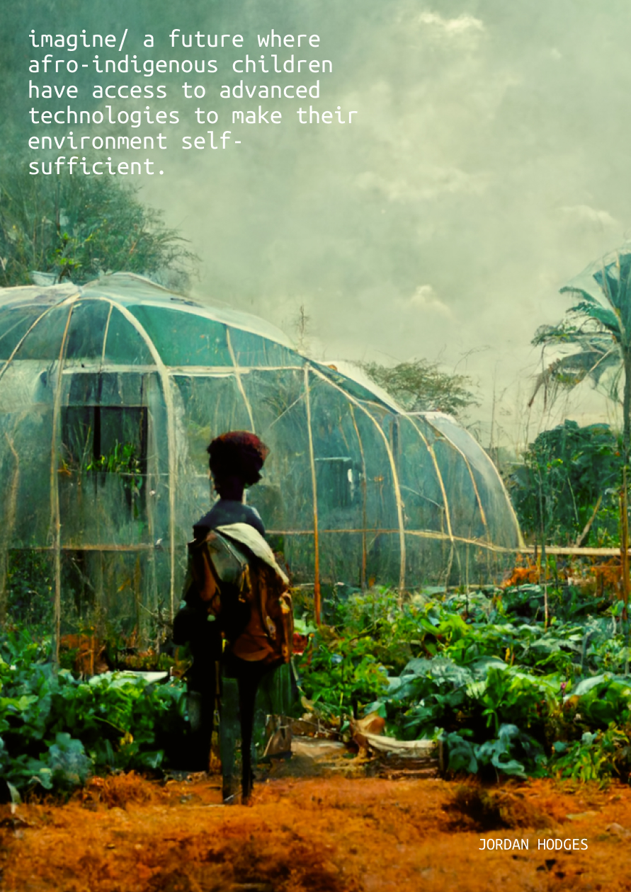

---
hide:
    - toc
---

# My Fight Poster

My vision is to build communal relationships with our environment to design systems and structures that are physically and metaphysically healthy for all beings. I aim to enable artists, designers, makers, agriculturalist, and activists of marginalized communities of color with knowledge of emerging and Indigenous technologies. To pilot this vision, I look to research natural materials that Afro-Indigenous cultures have relationships to and design processes that are in symbiosis with the culture, community and the environment.    
    