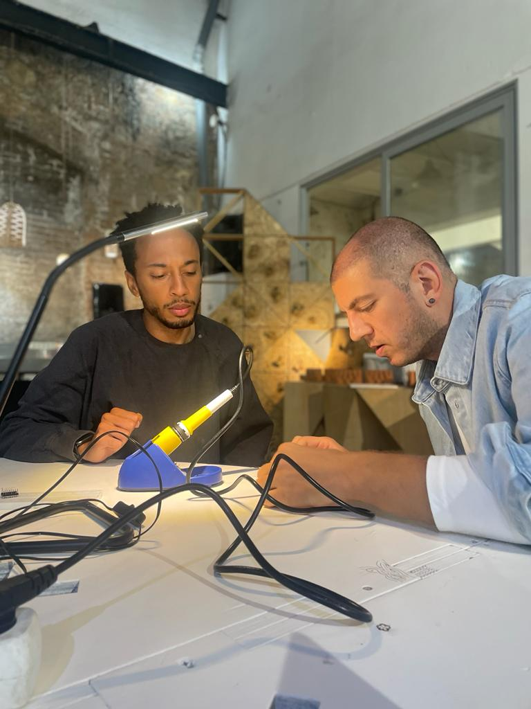

---
hide:
    - toc
---

# Tech Beyond the Myth

The word of the week was tinker. It is one of my favorite words at this point in my life because to me, it means to intentionally play and experiment to then find meaning. During Tech Beyond the Myth, we explored black box technology and how systems are designed to withold knowledge.

For our project, we split into groups and picked a dated device that we would disassemble and create a forensic report on how the device was designed and built. Our device was a rotating web camera that followed the most amplified soud in a conference room. We took apart the device and got a few of the motors to run when powering it to a power supply. Then, we developed a narrative for the new device where nature hypnotizes robots. We used a one of the motors out of the camera to create a pendulum swinging left and right. We used the plastic encasing of the camera to create a robot character for the narative. One of the motors burned out and so we used a motor from the fab lab that would rock the robot back and forth to show when the robot was hypnotized. We also used the microphone from the camera as a sensor to activate the pendulum.

The project turned out to be an inspiring experience for me because it exposed me to view electronics in a dauntless way. If there is a problem with modern devices, one of the first things that comes to mind is either buying a new device or going to the manufacturer to fix it. The concept of black box technology is the reason why a consumer would think this way. Manufacturers producing consumer based products know that there is power in knowledge hiding and they're capitalizing on this idea through mass consumption. Another group's device in class was a blender and they explained that the product was so cheap but so difficult to disassemble that it was designed to be replaced in a short amount of time. A year at best. I think the first thing that should come to mind when a device malfunctions is how can one fix it themselves. How can a system be designed for the participant to have the knowledge, if they choose to understand how it fully works?

[[Eagle Eyes](https://drive.google.com/file/d/1FwChP-DzAw8vrZQARXJbVx1tf8byYlYm/view?usp=share_link)]

